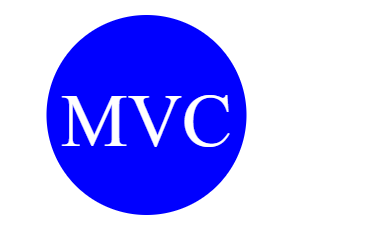
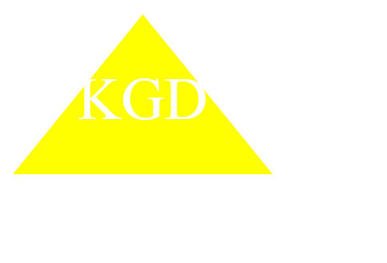

# SVG Shape Generator
  '

  ## Description

    To to build a Node.js command-line application that takes in user input to generate a logo and save it as an SVG fileLinks to an external site. The application prompts the user to select a color and shape, provide text for the logo, and save the generated SVG to a .svg file.

  ## Table of Content 
- [SVG Shape Generator](#svg-shape-generator)
  - [Description](#description)
  - [Table of Content](#table-of-content)
  - [Installation](#installation)
  - [Usage](#usage)
  - [Test](#test)
  - [License](#license)
  - [Links](#links)
  - [Github](#github)
  
## Installation
Node js
Inquirer package
Jest package

## Usage 
To generate a svg shape generator. Here are the examples. 

## Test
The test were done through Jest. Screenshots on Usage for reference. 

## License
  
Read about your license MIT

 ## Links 
SVG shape generated: https://drive.google.com/file/d/10eN2Hx-9y2hqYKuF3VJM69peQQvtG2og/view?usp=sharing 
SVG shapes tested: https://drive.google.com/file/d/1w3HZFc8cJzMuGgowOSoeMmo1Q0d8kal8/view?usp=sharing 

 ## Github 
Username: KaiDoll
